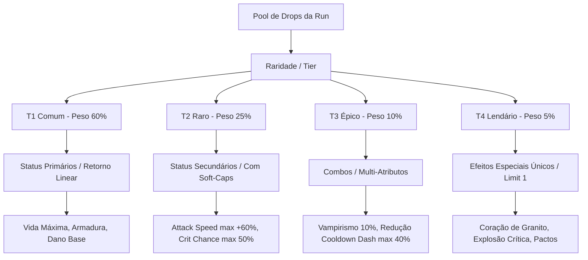

# 📊 MATRIZ E MAPA DE BALANCEAMENTO DE INFUSÕES (BROTATO × HADES)
*Arquivo de Documentação Interna do Projeto RogueLikeProject*
*Localização: Assets/Docs/INFUSION_BALANCE_MATRIX.md*

---

## 🧠 1. Mapa Mental de Arquitetura de Status & Pools (Mermaid)

---

## ⚖️ 2. Regras de Balanceamento: Caps, Soft-Caps & Limites de Acúmulo

| Atributo | Tipo de Limite | Valor Base (T1) | Teto Máximo (Cap) por Run | Motivo / Balanceamento |
| :--- | :--- | :--- | :--- | :--- |
| **Attack Speed (Melee)** | **Soft-Cap Rígido** | +8% por item | **+60% Máximo (1.60x)** | Impede o player de atacar em velocidade desgovernada. |
| **Chance Crítica (Crit Chance)**| **Hard-Cap** | +5% por item | **50% Máximo** | Garante que o crítico seja um bônus devastador, não 100% garantido. |
| **Dano Crítico (Crit Mult)** | **Escala Linear** | +15% por item | **+150% Máximo** | Incentiva investir em dano quando o crit chance está alto. |
| **Cargas de Dash** | **Hard-Cap** | +1 carga | **+2 Cargas Extra (Total 4)** | Mantém a esquiva tática sem invulnerabilidade infinita. |
| **Cooldown do Dash** | **Diminishing Returns**| -10% tempo | **-40% Máximo (0.60x)** | Evita spam ininterrupto de i-frames. |
| **Roubo de Vida (Vampirismo)** | **Hard-Cap** | +2% por hit | **10% Máximo + Cd 0.5s** | Cura gradual, sem imortalidade instantânea em hordas. |
| **Armadura (Damage Reduct)** | **Curva Assintótica** | +5 Armadura | **65% Redução Máxima** | Fórmula: `Redução = Armadura / (Armadura + 50)`. |
| **Velocidade de Movimento** | **Soft-Cap** | +5% por item | **+35% Máximo (1.35x)** | Impede que o player fuja mais rápido do que a câmera/sala. |

---

## 📜 3. Matriz Principal de Itens & Drops (32 Itens / 8 Inimigos)

| ID Item | Item & Origem | Tier | Efeitos & Atributos Concedidos | Peso no Drop | Max Stacks | Custo Base |
| :--- | :--- | :---: | :--- | :---: | :---: | :---: |
| `golem_chip_t1` | **Lasca de Pedra** *(Golem)* | T1 | +5 Armadura | 60 | 5 | 60 |
| `golem_plate_t2` | **Placa de Rocha** *(Golem)* | T2 | +10 Armadura, +0.5 Regen Armadura/s | 25 | 3 | 180 |
| `golem_core_t3` | **Núcleo de Pedra** *(Golem)* | T3 | +15 Armadura, +15% Knockback | 10 | 2 | 300 |
| `golem_heart_t4`| **Coração de Granito** *(Golem)* | T4 | +25 Armadura, **Especial:** Ao ficar <30% HP, ganha 50% de Armadura por 5s | 5 | **1** | 420 |
| `spider_leg_t1` | **Pata de Aranha** *(Spider)* | T1 | +6% Attack Speed | 60 | 4 | 60 |
| `spider_silk_t2`| **Glândula de Teia** *(Spider)* | T2 | +8% Attack Speed, -8% Cooldown Dash | 25 | 3 | 180 |
| `spider_fang_t3`| **Presa Venenosa** *(Spider)* | T3 | +10% Attack Speed, +5% Crit Chance | 10 | 2 | 300 |
| `spider_core_t4`| **Coroa da Ninhada** *(Spider)* | T4 | +15% Attack Speed, **Especial:** Ataques aplicam ralentamento de 30% e 15% a mais de dano | 5 | **1** | 420 |
| `goblin_ear_t1` | **Orelha Seca** *(Goblin)* | T1 | +5% Velocidade de Movimento | 60 | 4 | 60 |
| `goblin_pouch_t2`| **Bolsa de Moedas** *(Goblin)* | T2 | +8% Velocidade Movimento, +15% Drop Essência | 25 | 3 | 180 |
| `goblin_boots_t3`| **Botas de Mineiro** *(Goblin)* | T3 | +1 Carga de Dash, +10% Velocidade | 10 | 2 | 300 |
| `goblin_bomb_t4` | **Bomba Instável** *(Goblin)* | T4 | **Especial:** Ao dar Dash, deixa uma bomba que explode causando 80 de Dano Área | 5 | **1** | 420 |
| `sharp_shard_t1`| **Caco Afiado** *(SharpBlur)* | T1 | +5% Dano Melee | 60 | 5 | 60 |
| `sharp_edge_t2` | **Lâmina de Cristal** *(SharpBlur)*| T2 | +8% Dano Melee, +4% Crit Chance | 25 | 3 | 180 |
| `sharp_prism_t3`| **Prisma Cobre** *(SharpBlur)* | T3 | +12% Dano Melee, +15% Dano Crítico | 10 | 2 | 300 |
| `sharp_soul_t4` | **Essência Cortante** *(SharpBlur)*| T4 | +20% Dano Melee, **Especial:** Golpes Críticos causam Sangramento (30% dano extra em 3s) | 5 | **1** | 420 |
| `geo_dust_t1` | **Poeira Geode** *(Geobionte)* | T1 | +15 Vida Máxima | 60 | 5 | 60 |
| `geo_shell_t2` | **Casca Mineral** *(Geobionte)* | T2 | +30 Vida Máxima, +1 HP Regen/s | 25 | 3 | 180 |
| `geo_gem_t3` | **Gema Primal** *(Geobionte)* | T3 | +50 Vida Máxima, +2% Roubo de Vida | 10 | 2 | 300 |
| `geo_heart_t4` | **Coração de Geode** *(Geobionte)* | T4 | +100 Vida Máxima, **Especial:** Regenera 5% do HP máximo a cada sala concluída | 5 | **1** | 420 |

---

## 📈 4. Distribuição de Drop & Economia das Runs

### Tabela de Probabilidade de Drop por Nível/Fase

| Fase da Run | Peso T1 (Comum) | Peso T2 (Raro) | Peso T3 (Épico) | Peso T4 (Lendário) |
| :--- | :---: | :---: | :---: | :---: |
| **Nível 1 (Salas 1 a 4)** | **75%** | 20% | 5% | 0% |
| **Nível 2 (Salas 5 a 8)** | **50%** | 35% | 12% | 3% |
| **Nível 3 (Salas 9 a 12)**| **30%** | 45% | 20% | 5% |
| **Nível 4+ / Boss** | **15%** | 35% | 35% | **15%** |

### Taxa Global de Drop por Tipo de Inimigo

* **Mobs Comuns (Spider, Goblin, SharpBlur):** `22%` de chance de drop de item por morte.
* **Inimigos Médios / Elites (Golem, CrystalWatcher):** `50%` de chance de drop.
* **Minibosses / Geobionte / Boss:** `100%` de chance de drop (Drop garantido).

---

## 🔄 5. Fórmula de Inflação de Compra do Mercador (Hades Style)

$$\text{Custo Real} = \text{Custo Base do Item} \times \left(1.0 + \alpha \times P_{\text{total}}\right)$$

* **$\alpha$ (Coeficiente de Inflação):** `0.10` (10% a mais de custo por peso acumulado).
* **$P_{\text{total}}$ (Peso Acumulado de Infusões):**
  * Item T1 infundido = `+1.0 Peso`
  * Item T2 infundido = `+2.25 Peso`
  * Item T3 infundido = `+4.0 Peso`
  * Item T4 infundido = `+6.0 Peso`
