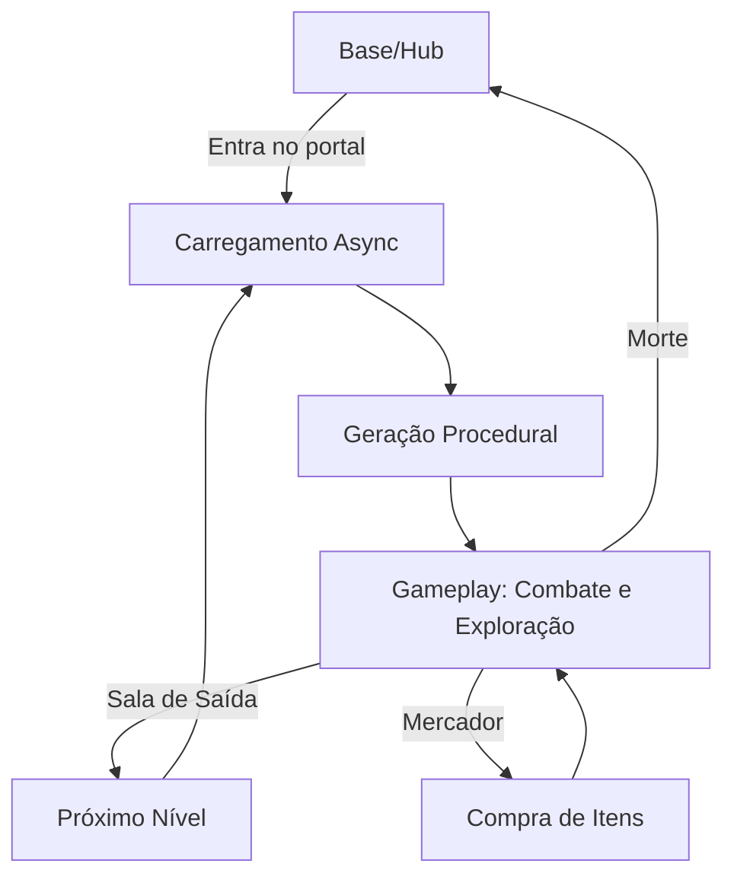

# RogueLike Project - Visão Geral

## O que é este Projeto?

Este é um **Roguelike 3D de ação** desenvolvido em **Unity** utilizando o template **URP (Universal Render Pipeline)**. O jogo segue a mecânica clássica de roguelikes: o jogador atravessa masmorras geradas proceduralmente, enfrentando inimigos, coletando itens e upgrades, com possibilidade de morte permanente e reinício.

---

## Arquitetura do Projeto

### Estrutura de Pastas Principais

```
Assets/
├── Scripts/
│   ├── Player/      # Sistemas do jogador (movimento, combate, dash, vida)
│   ├── Enemy/       # IA dos inimigos e mecânicas de dano
│   ├── MapGen/      # Geração procedural de níveis
│   ├── Rest/        # Pickups, utilidades e UI
│   └── Eptinho/     # Sistema de interação e menu (NPC/Hub)
├── Scenes/          # Cenas do jogo
├── Assets/          # Prefabs de personagens, armas e estruturas
├── Animation/       # Animações de personagens
├── VFX/             # Efeitos visuais
└── Materials/       # Materiais e texturas
```

---

## Sistemas Principais

### 🎮 Sistema do Jogador

#### Movimento (`PlayerM.cs`)
- Controle baseado em **Rigidbody** com física realista
- Sistema de **hitbox window** que modifica velocidade durante ataques
- Configurações separadas para:
  - `hitboxMoveSpeed` - Velocidade física durante impacto
  - `hitboxRotationSpeed` - Rotação durante impacto  
  - `hitboxAnimSpeed` - Velocidade da animação durante impacto

#### Dash (`DashM.cs`)
- Sistema de **cargas** (padrão: 2 dashes)
- **Cooldown** para recarregar todas as cargas
- Integração com UI para mostrar cargas restantes ou timer

#### Combate (`PrimaryAttackKnife.cs`)
- **Sistema de combo de 3 golpes**
- Danos escalonados por golpe do combo
- **Troca de armas** com diferentes stats:
  - **Mãos** (default): Alcance curto, dano baixo
  - **Adaga**: Alcance médio, dano moderado
  - **Espada**: Alcance alto, dano alto
- VFX de impacto ao acertar inimigos

#### Vida e Armadura (`PlayerHealth.cs`)
- Sistema de **HP + Armadura**
- Armadura absorve dano antes da vida
- **Sistema de respawn** com animação
- Integração com barras de UI
- `damageMultiplier` para upgrades de dano

#### Upgrades (`PlayerUpgrades.cs`)
- **Skill Tree** com upgrades compráveis
- Tipos de upgrade:
  - `HitboxAnimSpeed` - Velocidade de animação durante golpe
  - `HitboxMoveSpeed` - Movimento durante golpe
  - `HitboxRotationSpeed` - Rotação durante golpe

---

### 👾 Sistema de Inimigos

#### Magic Stone (`MagicStone_AI.cs`)
- Inimigo flutuante com comportamento **orbital**
- Se mantém a distância ideal do jogador
- **Ataque Skybeam**: Marca posição do jogador → dispara raio do céu
- **Teleporte defensivo**: Se teleporta quando o jogador chega perto
- Pode ser **buffado** pelo Crystal Tuner

#### Crystal Tuner (`CrystalTuner.cs`)
- Inimigo de **suporte** que voa baixo
- Conecta-se a outros inimigos via **beam visual**
- **Aplica buffs** aos aliados conectados:
  - Velocidade de ataque 2x
  - Velocidade de movimento +50%
- **Foge do jogador** enquanto protege aliados
- Prioridade alta: matá-lo remove buffs

#### Totem Spawner (`TotemSpawner.cs`)
- **Spawna inimigos** (caveiras) periodicamente
- Limite configurável de spawns
- Ativado por proximidade do jogador
- **Ao morrer**: todas as caveiras vinculadas são destruídas
- Pode ser buffado (spawn 2x mais rápido)

#### Homing Hazard / DamageZone
- Projéteis e zonas de dano para inimigos
- Usados pelas caveiras e outros ataques

---

### 🗺️ Geração Procedural

#### Level Generator (`LevelGenerator.cs`)
- Gera níveis usando **sistema de sockets**
- Salas são conectadas por pontos de encaixe (N, S, E, W)
- Fluxo:
  1. Sala inicial → adiciona sockets à fronteira
  2. Loop: escolhe socket → conecta sala compatível
  3. Após X salas → spawn sala do mercador
  4. Continua até limite → spawn sala de saída
- Salas especiais:
  - **Sala do Mercador**: Compra de itens
  - **Sala de Saída**: Próximo nível

#### Game Manager (`GameManager.cs`)
- **Singleton** persistente entre cenas
- Gerencia:
  - Transição de cenas com **loading screen**
  - Referência global ao jogador
  - Conexão do jogador à UI de cada fase
  - Respawn na base

---

### 📦 Pickups e Itens

| Script | Função |
|--------|--------|
| `Dagger_Pickup.cs` | Equipa arma tipo adaga |
| `Armorpickup.cs` | Restaura armadura |
| `DashRecharge.cs` | Recarrega cargas de dash |

---

### 🏠 Sistema de Hub (Eptinho)

- Hub central onde o jogador começa/retorna
- NPC interativo com menu de catálogo
- Sistema de interação baseado em trigger

---

## Cenas do Jogo

| Cena | Propósito |
|------|-----------|
| `Base.unity` | Hub principal / laboratório |
| `GameScene.unity` | Cena da dungeon gerada |
| `Eptinho.unity` | Área do NPC |
| `Testing.unity` | Testes de desenvolvimento |

---

## Tecnologias Utilizadas

- **Unity 6** (URP Template)
- **TextMesh Pro** para UI
- **Input System** (novo sistema de input do Unity)
- **Physics Rigidbody** para movimento
- **Coroutines** para timing de ataques e spawns

---

## Fluxo de Jogo



---

## Resumo

Este projeto é um **roguelike de ação em 3D** com:
- ✅ Geração procedural de dungeons
- ✅ Sistema de combate combo-based
- ✅ Dash com cargas
- ✅ Inimigos com IA comportamental
- ✅ Sistema de buff/debuff entre inimigos
- ✅ Upgrades e skill tree
- ✅ Hub persistente entre runs
- ✅ Transições assíncronas de cena
